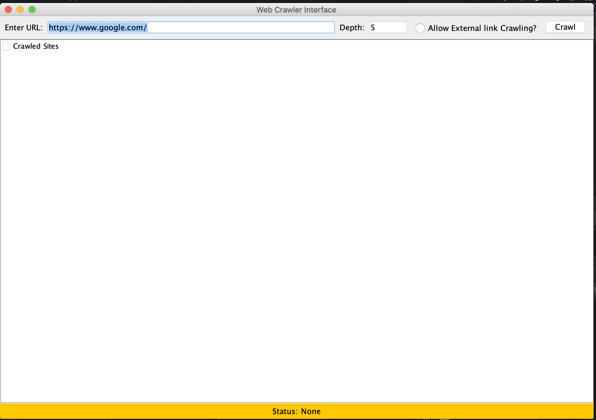
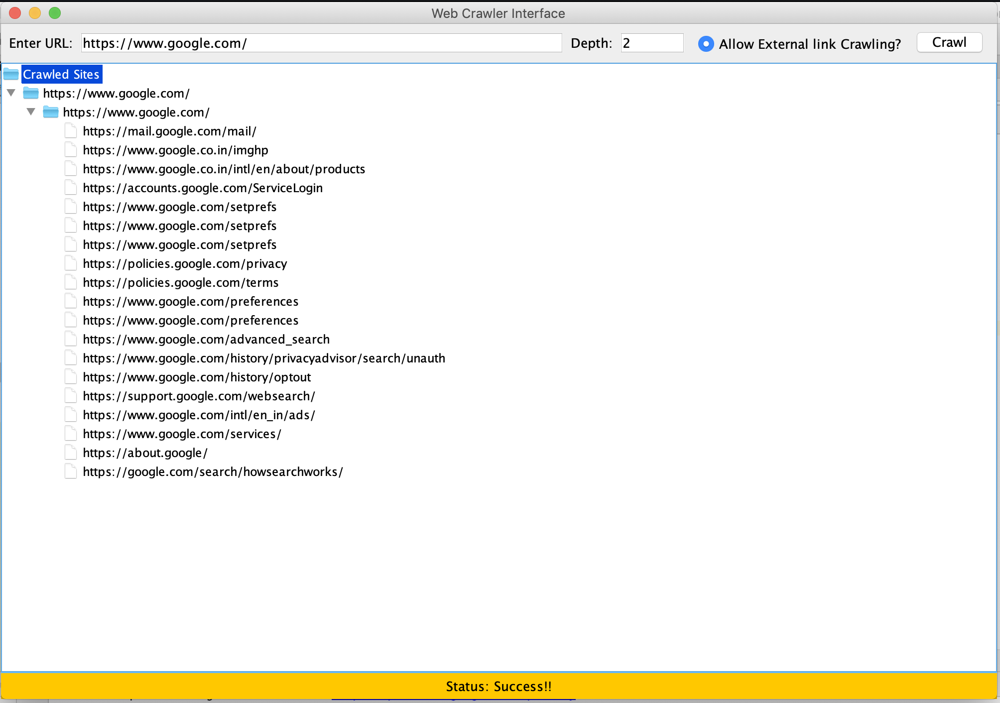
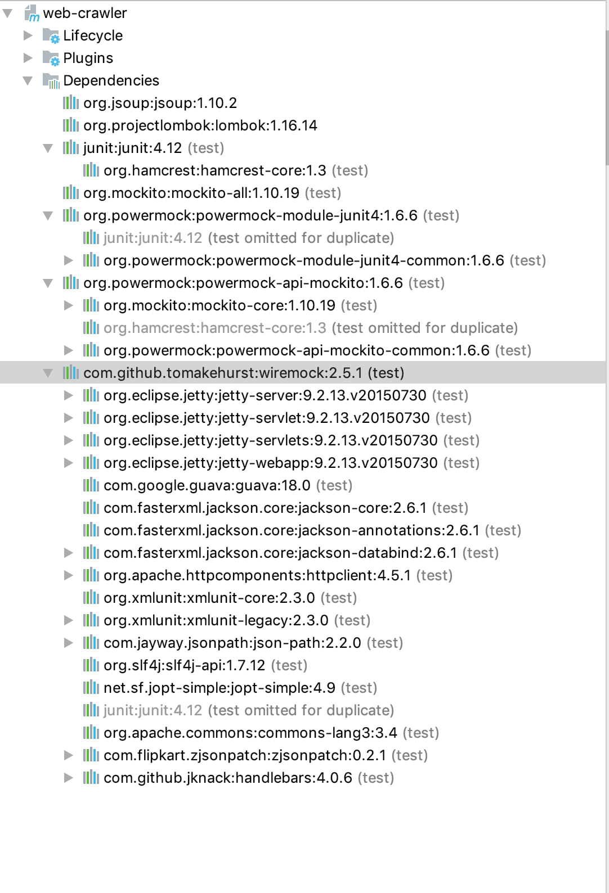

# Concurrent Web Crawler Interface
Java based concurrent web-crawler program
## Context
A Small Swing based Java application which lets us to crawl websites concurrently using multi-threading and concurrency concepts in Java
## Flow diagram
Following is the data flow indicating, how the web crawling works in the given application.

## Approach taken
Web crawling is an intensive task however the task does not involve complex computations. The 
## TDD 
TDD has been enforced at every stage of the implementation. I have also tried to excercise the text pyramid where I have also tried to stub and perform integration testing of the application.

## Views
Following are the simple depiction of the web crawler application.
### Default

### External Crawl result with 2 levels

### Crawl result with 2 levels

### Crawl result with 3 levels

## Known issues
## Dependencies
Following are the dependent libraries that are used by the crawler application.

## Tests
Following are the list of Unit tests and Integration tests that I have added as part of the application development.
>         Developed in Jetbrain's IntelliJ IDE
## Running the app
I have created a runnable jar archive that lets us use the application. You can download it from [Here](./web-crawler.jar).

## References
- https://dzone.com/articles/using-powermock-mock-static
- web document loading using jsoup : https://www.mkyong.com/java/jsoup-basic-web-crawler-example/
- JTree: https://docs.oracle.com/javase/tutorial/uiswing/components/tree.html