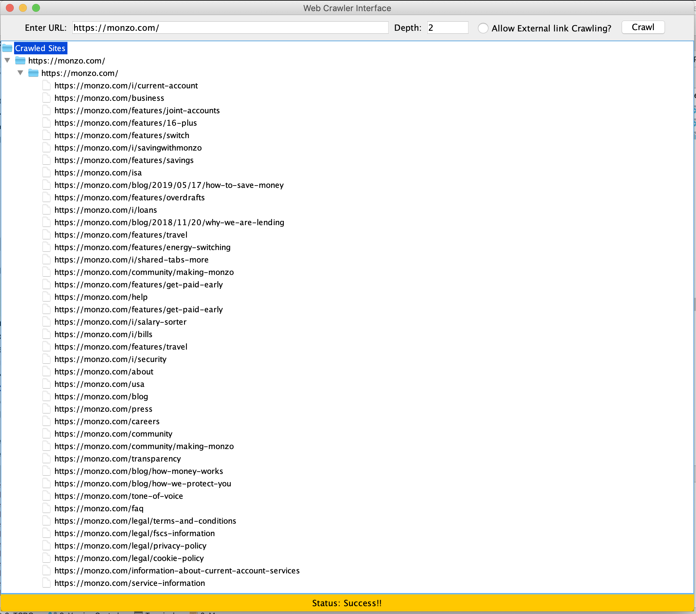

# Concurrent Web Crawler Interface
Java based concurrent web-crawler program
## Context
A Small Swing based Java application which lets us to crawl websites concurrently using multi-threading and concurrency concepts in Java.
## Flow diagram
Following is the data flow indicating, how the web crawling works in the given application.

## Approach taken
Web crawling is an intensive task, especially when it involves multilevel links on huge websites, however the task does not involve complex computations. Given that java provides multi-threaded program execution inside JVM we can make use of the various ExecutorServices available under `java.util.concurrent` package. 
- Given that the multi-threading is a great power it obviously comes with a responsibility of optimally using the resources, such as sharable thread resources, the execution environment and the processing overheads. In order to make use of resources optimally, I have chosen the FixedThreadPool approach where the Threads are put back to the pool once their task gets completed.

- Making use of the FunctionalInterface paradigm available under `java.util.function` package to leverage Async processing in the way that javascript's promises work eg. `java.util.function.BiConsumer` to make obtain the response when the entire crawling process is completed in an asyc ways such that there is no wait in the main thread to synchronously wait after calling the `CrawlerService.crawlSite(<>)` method.
- Handling internal references(with #) and query params(?param=value) on the same URL such that same URL with different internal redirection or queryParams does not get crawled twice unnecessarily.
- Configurable depth and ability to crawl external sites or sites with different domain origin added as references in the given site.
- jsoup to handle HTML parsing. Given that jsoup internally used JettyHTTPClient to get HTML based web pages, it was really helpful in taking the responsibility of handling the underlying nuances in dealing with HTTP based web requests.
- JavaSwing - inbuilt UI capability provided by Java SDE to provide simple yet sophisticated interfaces to process information.
    - JTree - Nested tree structure to render the crawled site response.

## TDD 
TDD has been enforced at every stage of the implementation. I have also tried to exercise the text pyramid where I have also tried to stub and perform integration testing of the application.

## Views
Following are the simple depiction of the web crawler application.
### Default

### External Crawl result with 2 levels

### Crawl result with 2 levels

### Crawl result with 3 levels

## Known issues
- Concurrency comes with its own catch. Following are few of the issues I haves identified as part of the application.
    - No guarantee in the order of execution. Given that each worker thread execution time depends on the size of the document(WebPage) downloaded and the number of children links present in it. For instance consider 2 children at same level which are spawned in a millisecond difference from each other. If the 2nd child takes less processing time and has the same child link as the 1st one, then the link(GrandChild) has more chances of getting inserted into the hierarchy twice.
    - Even though I have made use of `java.util.concurrent.ConcurrentSkipListSet` to keep track of the crawled links. There are chances due to the above issue that a link gets added twice when 2 concurrent threads call the `ConcurrentSkipListSet.contains(<>)`  method at the same time to get `false` and then making an interleaved call of `ConcurrentSkipListSet.add(<>)` with the same child link.
    - I have also seen a bottle neck due to concurrency in the below code as **executorService** is being passed to all the worker threads. Concurrent access of it creates locking and unlocking of it as a shared resource across all the threads trying to submit their child link workers. However, I have also noticed that the `executorService.submit(childCallable)` call is better in performance than `executorService.invokeAll(childCallableList)` since this waits for all the children to be allotted a thread while the submit method just uses **Fire And Forget Strategy**
    ` childrenPromises.add(executorService.submit(childCallable));` 
    
## Dependencies
Following are the dependent libraries that are used by the crawler application.

## Tests
Following are the list of Unit tests and Integration tests that I have added as part of the application development.

>         Developed in Jetbrain's IntelliJ IDE

## Running the app
I have created a runnable jar archive that lets us use the application. You can download it from [Here](./web-crawler.jar).

### build
`mvn clean install -U`

### run
`java ./web-crawler/target/web-crawler-1.0-SNAPSHOT.jar`

## References
- https://dzone.com/articles/using-powermock-mock-static
- web document loading using jsoup : https://www.mkyong.com/java/jsoup-basic-web-crawler-example/
- JTree: https://docs.oracle.com/javase/tutorial/uiswing/components/tree.html
- Thread pool executor: https://www.journaldev.com/1069/threadpoolexecutor-java-thread-pool-example-executorservice
- ConcurrentSkipListSet: https://docs.oracle.com/javase/8/docs/api/java/util/concurrent/ConcurrentSkipListSet.html
- Runnable Jar: https://stackoverflow.com/a/5258323